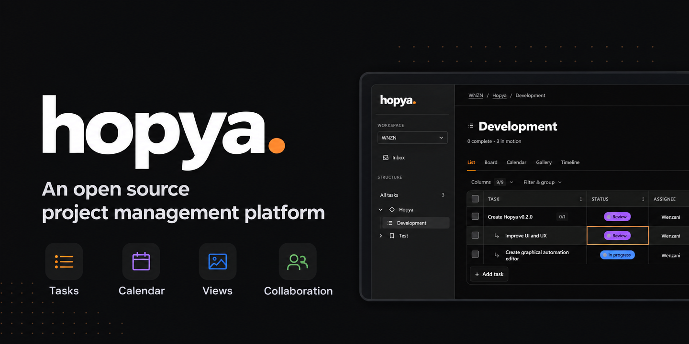

<div align="center">
  <h1>Hopya</h1>
  <p><strong>Your work, on your server.</strong></p>
  <p>A self-hosted task and project management app for teams.<br>
  Tasks, documents, tables, and automations in a private workspace.</p>
  <p>
    <a href="#quick-start">Quick start</a> ·
    <a href="#features">Features</a> ·
    <a href="#documentation">Documentation</a> ·
    <a href="https://github.com/wnzn/hopya/issues">Feedback</a>
  </p>
  <p>
    <a href="https://github.com/wnzn/hopya/actions/workflows/ci.yml"></a>
    <a href="LICENSE"></a>
  </p>
  <p>
    
  </p>
</div>

## Features

- **Organize your work.** Workspaces, projects, folders, and lists, with tasks, subtasks, checklists, and custom fields—including formulas.
- **Choose your view.** List, Board (Kanban), Calendar, Gallery, and Timeline over the same tasks, with responsive layouts and keyboard-accessible controls.
- **Keep content together.** Rich-text Documents and spreadsheet-style Tables with typed columns, filters, sorting, calculations, and CSV/JSON transfer. Connect live PostgreSQL, MySQL, or SQLite Tables with permission-checked cell editing.
- **Collaborate in context.** Assignees, statuses, priorities, tags, threaded comments, mentions, reactions, and a workspace Inbox. Custom roles control each member's access.
- **Make work visual.** Private attachments, image upload and paste in task bodies and comments, Gallery image carousels, and profile pictures.
- **Connect your tools.** Visual automation workflows with branching, HTTP and email actions, and run monitoring. A REST API, optional AI-assisted task proposals, and Model Context Protocol (MCP) access.
- **Own your data.** SQLite or PostgreSQL, local or S3-compatible file storage, local accounts or OIDC sign-in, revocable API tokens, audit records, and task/workspace exports.

Local accounts, SQLite, and filesystem storage work out of the box. Cloud services and AI are optional; no vendor account is required.

> **Early release.** Back up your data and review the [deployment](docs/deployment.md) and [security](docs/security.md) guides before using Hopya for important workloads.

## Quick Start

You need Git, Docker Engine, and Docker Compose. With Node.js 24 installed, run:

```sh
git clone https://github.com/wnzn/hopya.git
cd hopya
npm run init:env
docker compose up -d --build --wait
```

<details>
<summary>Docker-only setup (no Node.js on the host)</summary>

```sh
git clone https://github.com/wnzn/hopya.git
cd hopya
docker run --rm --network none --read-only --cap-drop ALL \
  --security-opt no-new-privileges:true --user "$(id -u):$(id -g)" \
  -v "$PWD:/work" -w /work node:24-bookworm-slim \
  node --experimental-strip-types ops/init-env.ts
docker compose up -d --build --wait
```

</details>

Open **[localhost:8888](http://localhost:8888)** and create the first administrator using `SETUP_TOKEN` from the generated `.env`. The initializer creates private secrets, leaves existing configuration intact, and creates no default accounts.

Create a workspace, add a list, and capture your first task. Projects and folders help organize larger workspaces. The [user guide](docs/user-guide.md) covers views, collaboration, and account/workspace settings.

The default setup runs on one server, listens on `127.0.0.1:8888`, and stores the SQLite database and files in `./data`. For remote access, follow the [HTTPS setup](docs/deployment.md#https) and set `APP_URL` to your public origin. Keep private API and web ports internal.

[Configuration](docs/deployment.md#configuration) · [PostgreSQL](docs/deployment.md#postgresql) · [Backups](docs/deployment.md#backup-and-restore) · [Upgrades](docs/deployment.md#upgrades)

Workspace exports contain portable records and file metadata, not account credentials or file bytes. Use the backup guide for a complete recovery copy, including your private `.env`.

## API And MCP

The [REST API](docs/api.md) is available under `/api/v1`. Create a personal token in **Account settings** and send it as `Authorization: Bearer <token>`.

MCP supports a local stdio process and an opt-in SSE endpoint. Both use the token owner's current workspace permissions and are read-only by default; enabling mutation tools still requires the client to obtain human approval for each write.

<details>
<summary>Connect an MCP client</summary>

For stdio, use Node.js 24, run `npm ci` and `npm run build -w @hopya/api` in your checkout, then configure your MCP client to launch:

```text
Command: node
Arguments: apps/api/build/bin/mcp.js
Working directory: /absolute/path/to/hopya
Environment:
  HOPYA_API_URL=http://localhost:8888
  HOPYA_API_TOKEN=<personal token>
```

For SSE, enable it in **Administration > Site settings**, connect to `https://your-hopya.example/api/v1/mcp/sse`, and configure `Authorization: Bearer <personal token>` as a header. Keep tokens in the client's private configuration, never in the URL.

See the [MCP integration guide](docs/integrations.md#mcp) for write enablement, tools, and transport limits.

</details>

## Documentation

| Guide | What's inside |
| --- | --- |
| [User guide](docs/user-guide.md) | Tasks, views, Documents, Tables, collaboration, and settings |
| [Deployment](docs/deployment.md) | Docker, configuration, HTTPS, storage, backups, and upgrades |
| [Integrations](docs/integrations.md) | AI, MCP, S3-compatible storage, and [OIDC setup](docs/oidc-setup.md) |
| [Images](docs/images.md) | Private uploads, Gallery covers, draft recovery, and [profile photos](docs/profile-photos.md) |
| [Security](docs/security.md) | Authentication, workspace permissions, and integration boundaries |
| [Architecture](docs/architecture.md) | Application design, [REST API](docs/api.md), and [Effect workflows](docs/effect-workflows.md) |

## Development

Built with **TypeScript, AdonisJS, Astro, React, and Effect**. Use Node.js 24, pinned in [`.node-version`](.node-version).

From a fresh checkout:

```sh
npm run init:env -- --development
npm ci
npm run dev
```

Open **[localhost:4321](http://localhost:4321)**. The initializer refuses to replace an existing `.env`; use a separate checkout for development if you already configured the Docker deployment.

`npm run check` runs typechecks, API/unit tests, and production builds. Browser tests (`npm run test:browser`) and deployment verification (`npm run test:deployment`) are separate, explicit runs.

Bug reports and focused pull requests are welcome. [Open an issue](https://github.com/wnzn/hopya/issues) with reproduction steps, your version, and the expected and actual behavior.

## License

[MIT](LICENSE) · Wenzani Labs LLC
